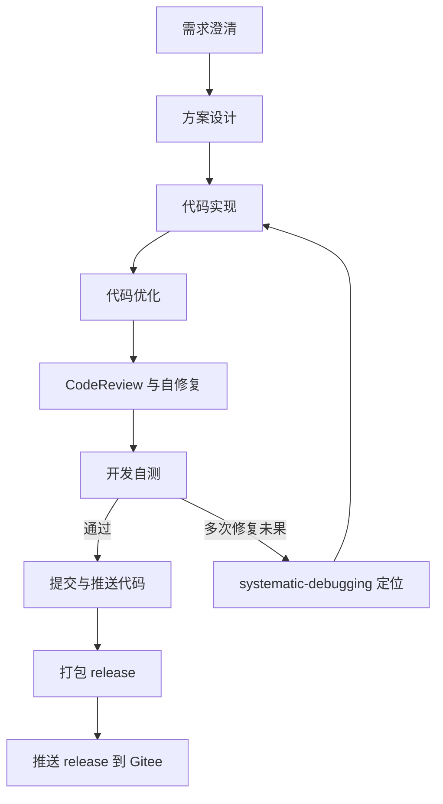
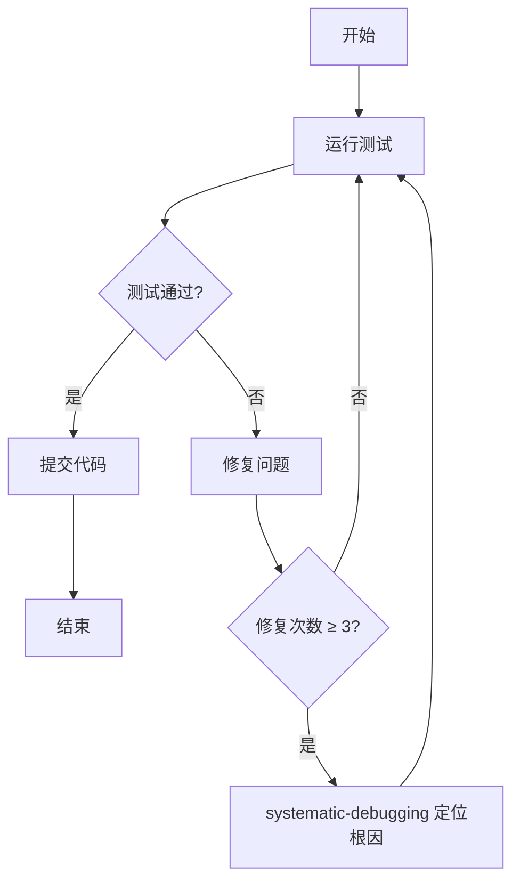
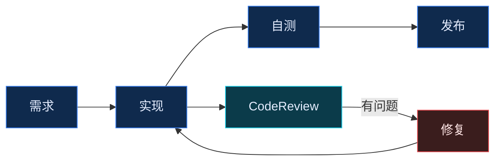

# Mermaid 流程图示例

开发工作流从需求到发布的执行流程：

```mermaid
flowchart TD
  A[需求澄清] --> B[方案设计]
  B --> C[代码实现]
  C --> D[代码优化]
  D --> E[CodeReview 与自修复]
  E --> F[开发自测]
  F -->|通过| G[提交与推送代码]
  F -->|多次修复未果| H[systematic-debugging 定位]
  H --> C
  G --> I[打包 release]
  I --> J[推送 release 到 Gitee]
```

循环（回边）示例：自测不通过就回到修复，超过次数转 systematic-debugging，再回到验证。

```mermaid
flowchart TD
  A[开始] --> B[运行测试]
  B --> C{测试通过?}
  C -->|是| D[提交代码]
  C -->|否| E[修复问题]
  E --> F{修复次数 ≥ 3?}
  F -->|否| B
  F -->|是| G[systematic-debugging 定位根因]
  G --> B
  D --> H[结束]
```

同一张图里给部分节点设置不同背景色（`classDef` + `class`）：

```mermaid
flowchart LR
  A[需求] --> B[实现] --> C[自测] --> D[发布]
  B --> E[CodeReview]
  E -->|有问题| F[修复]
  F --> B

  classDef normal fill:#0f2a4d,stroke:#3b82f6,color:#e5edff
  classDef hot fill:#0b3b4a,stroke:#22d3ee,color:#e5edff
  classDef danger fill:#3a1d1d,stroke:#e5484d,color:#ffe5e5
  class A,B,C,D normal
  class E hot
  class F danger
```

