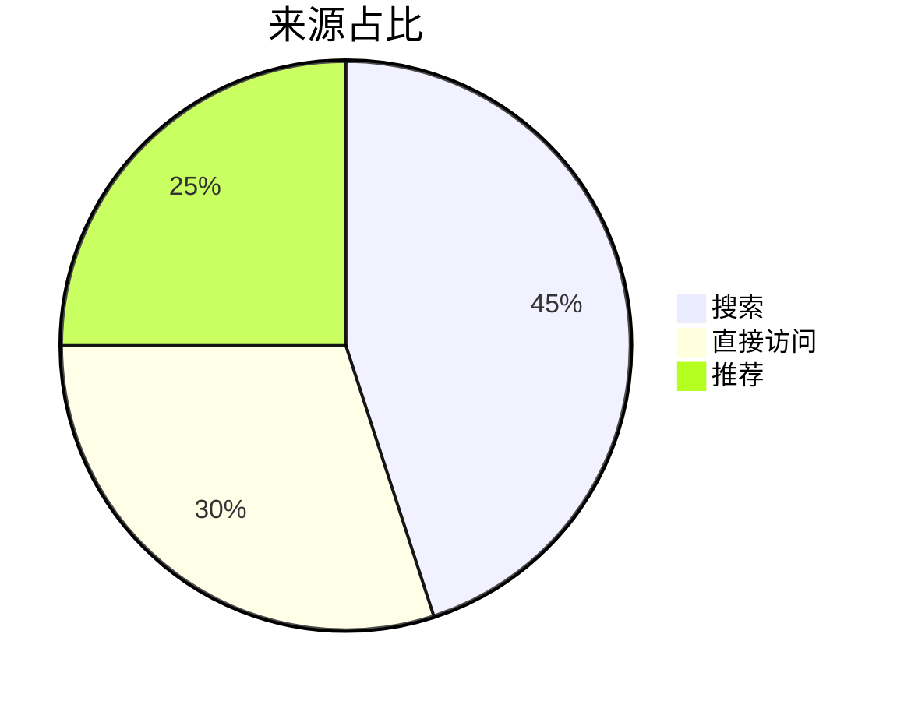

# 折线图 + 饼图并排

```mermaid row
xychart-beta
    title "访问趋势"
    x-axis "月份" [1月, 2月, 3月, 4月, 5月]
    y-axis "访问量" 0 --> 120
    line [20, 45, 60, 85, 110]
```

```mermaid row
pie title 来源占比
    "搜索" : 45
    "直接访问" : 30
    "推荐" : 25
```
